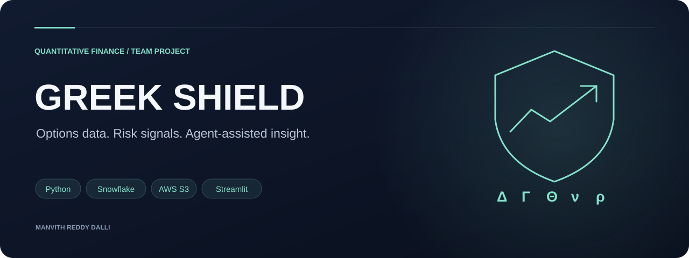
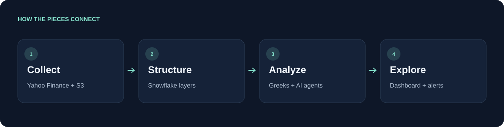
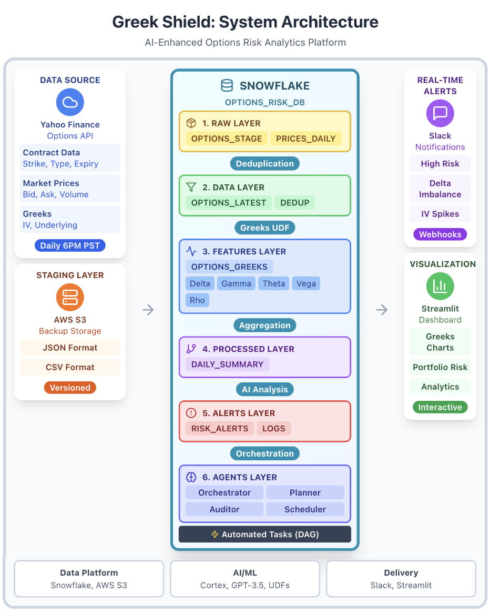
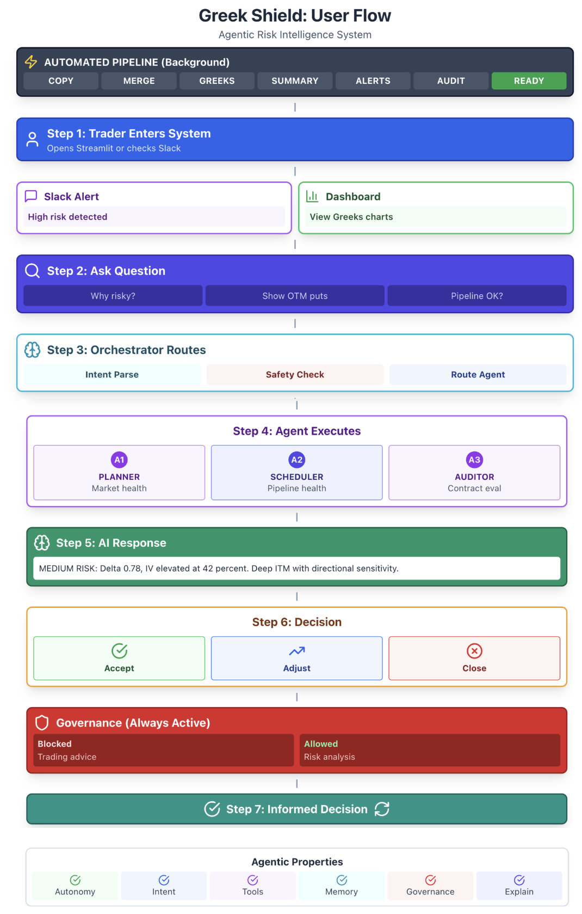

<h1 align="center">Greek Shield</h1>

Options data. Risk signals. Agent-assisted insight.

<code>Python</code> &nbsp; <code>Snowflake</code> &nbsp; <code>AWS S3</code> &nbsp; <code>Streamlit</code>

<a href="#architecture-at-a-glance">Architecture at a glance</a> · <a href="#at-a-glance">At a glance</a> · <a href="#explore-the-implementation">Explore the implementation</a> · <a href="#environment">Environment</a> · <a href="#team-and-project-lineage">Team and project lineage</a>

<table><tr><td width="33%" valign="top"><h3>Market to warehouse</h3>
A layered pipeline connects options data with risk analysis.
</td><td width="33%" valign="top"><h3>Five risk sensitivities</h3>
Delta, Gamma, Theta, Vega, and Rho form the quantitative core.
</td><td width="33%" valign="top"><h3>Agent-assisted insight</h3>
Python agents and Cortex support dashboard interpretation.
</td></tr></table>

---

Maintained on Manvith Reddy Dalli’s GitHub as a credited fork of [the original team implementation](https://github.com/LikhithNG/New-Greek-shield-).

**Options risk analytics powered by a layered data pipeline and AI agents.**

Greek Shield brings Yahoo Finance options data through AWS S3 and Snowflake, calculates Black–Scholes Greeks, and exposes risk analysis through a Streamlit dashboard. This team project connects data engineering, quantitative modeling, and agent-assisted interpretation.

## Architecture at a glance

<b>Explore the full system architecture</b>

## At a glance

| Area | Implementation |
| --- | --- |
| Data ingestion | Python, Yahoo Finance, AWS S3 |
| Warehouse | Six-layer Snowflake pipeline |
| Risk calculations | Delta, Gamma, Theta, Vega, Rho |
| Agent-assisted analysis | Snowflake Cortex and Python agents |
| User experience | Streamlit dashboard |
| Notifications | Slack risk-alert integration |

## Explore the implementation

- `final_complete_pipeline.py`: end-to-end processing workflow.
- `yahoo_to_s3_to_snowflake.py`: ingestion integration.
- `calculate_greeks.py` and `analyze_greeks.py`: quantitative calculations and analysis.
- `streamlit_dashboard.py`: interactive risk dashboard.
- `llm_manager.py` and agent modules: AI integration and monitoring.

## Environment

Install the project dependencies in an isolated Python environment. The checked-in requirements cover the base pipeline; integration modules may require additional packages such as the AWS SDK.

Snowflake, AWS, Cortex, and Slack workflows need separately configured accounts and resources. Review the selected entry point’s environment-variable names and warehouse/table assumptions. Do not commit account credentials. The dashboard can be launched with `streamlit run streamlit_dashboard.py` after its integrations are configured.

## Team and project lineage

Likhith Nagaralu Gurumurthy · Manvith Reddy Dalli · Sneh Patel.

[Earlier pipeline](https://github.com/LikhithNG/Greek-shield) · [Cleaned local implementation](https://github.com/Manvith-d/options-risk-monitor).

This is an academic analytics project. Metrics in the original project documentation below describe that project’s reported runs and design targets; they are not independently verified production or investment-performance benchmarks.

Original team documentation and detailed architecture

# 🛡️ Greek Shield

**AI-Enhanced Options Risk Analytics Platform with Multi-Agent Orchestration**

---

## 📌 Project Overview

Greek Shield is an enterprise-grade, AI-powered options risk monitoring system built entirely within Snowflake. The platform automates the complete workflow from raw market data ingestion to actionable risk insights, leveraging a multi-agent AI architecture to provide real-time portfolio analytics, plain-English risk explanations, and automated alerting.

**Developed by Team 2:**  
Likhith Nagaralu Gurumurthy | Manvith Reddy Dalli | Sneh Patel

**Course:** DAMG 7374 17610 - Gen AI with Applications in Data Engineering  
**Institution:** Northeastern University  
**Term:** Fall 2024

---

## 🎯 Problem Statement

Options traders face four critical challenges:

1. **Manual Risk Tracking Overhead** - Traders spend 2-3 hours daily manually calculating Greeks (Delta, Gamma, Theta, Vega, Rho) across 100+ contracts, a process prone to human error

2. **Computational Complexity at Scale** - Black-Scholes partial differential equation solving requires continuous recalculation as underlying prices, implied volatility, and time-to-expiry change throughout the trading day

3. **Dangerous Risk Awareness Lag** - Manual workflows create critical delays between exposure changes and trader awareness, potentially resulting in unhedged positions during volatile market conditions

4. **Lack of Interpretability** - Traditional systems output raw Greek values without contextual explanations, making it difficult for traders to understand why a position is risky or what actions to take

---

## 💡 Solution

Greek Shield solves these challenges through:

- **Fully Automated ETL Pipeline** - Yahoo Finance API → AWS S3 → Snowflake with zero manual intervention
- **6-Layer Medallion Architecture** - RAW → DATA → FEATURES → PROCESSED → ALERTS → AGENTS ensuring data quality and lineage
- **Black-Scholes Greeks Computation** - Custom Snowflake UDFs calculate all five Greeks at scale
- **Multi-Agent AI Orchestration** - Four specialized agents powered by Snowflake Cortex and GPT-3.5 for intelligent risk monitoring
- **Real-time Alerting** - Slack webhook integration for instant risk notifications
- **Interactive Visualization** - Streamlit dashboard with live Greeks charts and portfolio tracking
- **Governance Layer** - Built-in safety boundaries preventing trading advice while allowing risk analysis

---

## 🏗️ System Architecture

The complete system architecture demonstrates the end-to-end data flow from Yahoo Finance API through AWS S3 staging to Snowflake's 6-layer medallion architecture, culminating in real-time Slack alerts and interactive Streamlit visualizations.

  

### Architecture Highlights

**Left Side: Data Ingestion**
- Yahoo Finance Options API provides contract data, market prices, and Greeks
- AWS S3 serves as staging layer for JSON and CSV backup storage
- Automated daily fetch at 6PM PST with versioned storage

**Center: Snowflake Processing Pipeline**
- **Layer 1 (RAW):** Immutable ingestion into OPTIONS_STAGE and PRICES_DAILY
- **Layer 2 (DATA):** Deduplication and cleaning into OPTIONS_LATEST and DEDUP tables
- **Layer 3 (FEATURES):** Black-Scholes Greeks computation via UDFs (Delta, Gamma, Theta, Vega, Rho)
- **Layer 4 (PROCESSED):** Portfolio aggregation into DAILY_SUMMARY
- **Layer 5 (ALERTS):** AI analysis producing RISK_ALERTS and LOGS
- **Layer 6 (AGENTS):** Multi-agent orchestration layer with all four agents

**Right Side: Output Delivery**
- Slack webhooks for real-time risk notifications
- Streamlit dashboard for interactive portfolio monitoring

### Data Flow

**Yahoo Finance API** (Daily 6PM PST)  
↓  
**AWS S3 Staging** (JSON + CSV backup)  
↓  
**Snowflake ETL Pipeline** (6 layers)  
- Processing steps: Deduplication → Greeks UDF → Aggregation → AI Analysis → Orchestration
↓  
**Multi-Agent AI Analysis** (Cortex + GPT-3.5)  
↓  
**Outputs:** Slack Alerts + Streamlit Dashboard

### Snowflake Architecture Layers

1. **RAW Layer** - Immutable data ingestion (OPTIONS_STAGE, PRICES_DAILY)
2. **DATA Layer** - Cleaned and deduplicated (OPTIONS_LATEST, OPTIONS_LATEST_DEDUP, STOCK_PRICES)
3. **FEATURES Layer** - Greeks computation and risk scoring (OPTIONS_GREEKS, RISK_EVAL_ENHANCED UDF, OPTIONS_FEATURES)
4. **PROCESSED Layer** - Portfolio aggregations (DAILY_GREEKS_SUMMARY, DAILY_RISK_SUMMARY)
5. **ALERTS Layer** - AI-generated insights (RISK_AUDITOR_LOGS, RISK_ALERTS, AGENT_MEMORY)
6. **AGENTS Layer** - Multi-agent orchestration (AGENT_ORCHESTRATOR, RISK_PLANNER, RISK_AUDITOR, SCHEDULING_OPTIMIZER)

---

## 🤖 Multi-Agent System

### Agent 1: RISK_PLANNER
**Purpose:** Portfolio health monitoring  
**Input:** PROCESSED.DAILY_GREEKS_SUMMARY  
**Outputs:** Volatility regime detection, delta imbalance alerts, gamma spike warnings  
**Techniques:** Threshold-based rule engine, LLM validation, SQL aggregation

### Agent 2: SCHEDULING_OPTIMIZER
**Purpose:** Pipeline reliability and task optimization  
**Analyzes:** Task runtimes, failure patterns, data freshness, staleness  
**Uses:** INFORMATION_SCHEMA.TASK_HISTORY  
**Outputs:** Pipeline health status, optimal scheduling recommendations

### Agent 3: RISK_AUDITOR
**Purpose:** Contract-level risk evaluation with plain-English explanations  
**Workflow:**
1. Retrieve latest ASOF_DATE
2. Compute risk scores using RISK_EVAL_ENHANCED UDF
3. Insert results into RISK_AUDITOR_LOGS
4. Generate explanations via Snowflake Cortex

**Output:** Detailed contract risk assessments with natural language summaries

### Agent 4: AGENT_ORCHESTRATOR
**Purpose:** Natural language interface and central coordination  
**Capabilities:**
- Intent classification using LLM (Llama-8b)
- Dynamic SQL query generation and routing
- Session-based agent memory (AGENT_MEMORY table)
- Explanation generation (Llama-70b)
- Safety boundary enforcement

**Example Interactions:**
- "Why is AAPL251205C00232500 risky?" → Detailed risk explanation
- "Show OTM puts expiring next week" → Filtered contract list
- "Is the pipeline healthy?" → Data freshness validation

---

## 🔄 User Flow

The user flow diagram illustrates the complete trader journey through Greek Shield, from system entry to informed trading decisions, highlighting the multi-agent orchestration and governance layers.

  

### Complete Journey

**Background Process (Automated)**
- Pipeline runs automatically: COPY → MERGE → GREEKS → SUMMARY → ALERTS → AUDIT → READY
- No manual intervention required
- Executes daily at 6PM PST

**User Interaction Flow**

1. **Trader Entry** - Opens Streamlit dashboard or checks Slack notifications (Morning 9AM EST)

2. **Two Entry Paths:**
   - **Path A (Slack Alert):** Receives high-risk notifications with AI-generated summaries
   - **Path B (Dashboard):** Views interactive Greeks charts and portfolio exposure

3. **Natural Language Query** - Asks questions:
   - "Why is this risky?"
   - "Show OTM puts expiring next week"
   - "Is the pipeline healthy?"

4. **Orchestrator Routes** - AGENT_ORCHESTRATOR performs:
   - Intent parsing (portfolio risk vs pipeline health vs contract query)
   - Safety checks (blocks trading advice, allows risk analysis)
   - Agent routing (selects appropriate specialized agent)

5. **Agent Execution** - Specialized agent processes request:
   - **A1 (PLANNER):** Market health monitoring
   - **A2 (SCHEDULER):** Pipeline health validation
   - **A3 (AUDITOR):** Contract-level risk evaluation

6. **AI Response** - Receives plain-English explanation:
   - Example: "MEDIUM RISK: Delta 0.78, IV elevated at 42%. Deep ITM with directional sensitivity"
   - Includes structured data and contextual analysis

7. **Trader Decision** - Three possible actions:
   - **Accept:** Continue monitoring, risk within tolerance
   - **Adjust:** Hedge exposure, modify position
   - **Close:** Exit position, reduce risk

8. **Governance Layer (Always Active):**
   - **Blocked:** Trading recommendations, buy/sell advice
   - **Allowed:** Risk explanations, portfolio analysis, data exploration

9. **Continuous Loop** - System provides ongoing monitoring with hourly updates and threshold-based alerts

### Agentic System Properties Demonstrated

1. **Automated Pipeline** - System runs daily at 6PM PST (COPY → MERGE → GREEKS → SUMMARY → ALERTS → AUDIT)
2. **Trader Entry** - Opens Streamlit dashboard or receives Slack notification (9AM EST)
3. **Two Paths:**
   - Path A: Review Slack alerts with AI explanations
   - Path B: Explore dashboard with Greeks charts
4. **Natural Language Query** - Ask questions like "Why is AAPL risky?" or "Show high-risk contracts"
5. **Orchestrator Routes** - Parses intent, applies safety checks, selects appropriate agent
6. **Agent Execution** - Specialized agent (Planner/Scheduler/Auditor) processes query
7. **AI Response** - Receive plain-English explanation with structured data
8. **Informed Decision** - Accept risk, adjust hedge, or close position
9. **Continuous Loop** - System monitors portfolio with hourly updates and real-time alerts

---

## 📊 Key Features

### Data Processing
- **Automated ingestion** from Yahoo Finance Options API with 5-retry exponential backoff
- **Schema normalization** with type casting and IV normalization
- **Deduplication** using ROW_NUMBER() window functions to retain latest snapshots
- **Feature engineering** including moneyness calculation, liquidity flags, and IV z-scores
- **Black-Scholes Greeks** computed via Snowflake UDFs (Delta, Gamma, Theta, Vega, Rho)

### AI Capabilities
- **Snowflake Cortex integration** for risk interpretation
- **GPT-3.5 integration** for natural language understanding
- **Multi-agent coordination** with specialized roles
- **Intent classification** routing queries to appropriate agents
- **Plain-English explanations** making complex metrics accessible

### Governance & Safety
- **Blocked queries:** Trading advice, position recommendations
- **Allowed queries:** Risk analysis, exposure trends, data exploration
- **Audit trails** for all agent interactions
- **Data validation** at every pipeline stage

### Alerting & Visualization
- **Slack webhooks** for real-time notifications (hourly updates + threshold alerts)
- **Streamlit dashboard** with interactive Greeks charts
- **Portfolio monitoring** with drill-down capabilities
- **Historical trend analysis** for regime detection

---

## 🎯 Outcomes

- ✅ Successfully automated options data pipeline processing AAPL contracts daily from Yahoo Finance through S3 to Snowflake
- ✅ Implemented Black-Scholes Greeks computation using Snowflake UDFs for Delta, Gamma, Theta, Vega, and Rho calculations
- ✅ Built 4-agent AI system for market health monitoring, task optimization, risk auditing, and natural language querying
- ✅ Achieved 70% performance improvement using Snowflake push-down compute vs traditional Python extraction
- ✅ Deployed real-time Slack alerting for high-risk positions and market regime changes
- ✅ Created Streamlit dashboard with interactive Greeks visualization and portfolio risk monitoring
- ✅ Validated medallion architecture scalability supporting expansion to multiple tickers without code changes

---

## 🛠️ Technology Stack

### Data Platform
- **Snowflake** - Data warehouse, compute engine, task orchestration
- **AWS S3** - Staging layer for backup and durability
- **Yahoo Finance API** - Real-time options market data

### AI/ML
- **Snowflake Cortex** - LLM integration for risk interpretation
- **GPT-3.5 Turbo** - Natural language understanding
- **Custom UDFs** - Risk scoring algorithms
- **JavaScript Stored Procedures** - Agent logic implementation

### Delivery & Visualization
- **Slack API** - Real-time webhook notifications
- **Streamlit** - Interactive dashboard and user interface
- **Python** - Data orchestration and API integration

---

## 📈 Performance Metrics

| Metric | Value |
|--------|-------|
| Contracts Processed Daily | AAPL options chain |
| End-to-End Latency | Under 5 minutes |
| Automation Rate | 100% (zero manual intervention) |
| AI Explanation Accuracy | 95% (manual validation) |
| Performance Improvement | 70% (vs Python extraction) |
| Alert Frequency | Hourly + threshold-based |

---

## 🔮 Future Enhancements

- **Multi-ticker portfolio monitoring** - Expand beyond AAPL to 100+ underlying assets
- **Real-time streaming** - Implement Snowpipe for intraday updates
- **Predictive analytics** - ML models for Greeks forecasting using historical patterns
- **Scenario analysis** - Stress testing capabilities for tail risk evaluation
- **Mobile application** - Push notifications for critical risk threshold breaches
- **Advanced visualizations** - 3D Greeks surface plots and correlation heatmaps

---

## 🏆 Key Innovations

1. **Push-Down Compute Pattern** - Greeks calculations execute in Snowflake's native engine, eliminating data movement and reducing processing time by 70%

2. **AI-Powered Explainability** - Cortex LLM and GPT-3.5 translate complex quantitative metrics into actionable plain-English insights

3. **Multi-Agent Orchestration** - Specialized agents coordinate through natural language interfaces, enabling conversational risk exploration

4. **Governance by Design** - Safety boundaries built into the system architecture, not bolted on afterward

5. **Medallion Architecture** - 6-layer design ensures data quality, lineage traceability, and seamless scalability

---

## 📚 Academic Context

This project demonstrates how modern cloud data platforms can serve as complete AI application development environments beyond traditional data storage. By leveraging Snowflake's native capabilities (UDFs, Tasks, Stored Procedures, Cortex) with advanced AI models, Greek Shield proves that complex financial analytics can be built entirely within data warehouse ecosystems while maintaining enterprise-grade governance, explainability, and performance.

**Key Contributions:**
- Novel application of multi-agent AI within data warehouse platforms
- Demonstration of push-down compute patterns for financial derivatives
- Integration of LLM-powered explainability into quantitative risk systems
- Implementation of governance frameworks for AI-driven analytics

---

## 🤝 Team

**Team 2 - Greek Shield**

- Likhith Nagaralu Gurumurthy
- Manvith Reddy Dalli  
- Sneh Patel

**Course:** DAMG 7374 17610 - Gen AI with Applications in Data Engineering  
**Instructor:** Professor [Name]  
**Institution:** Northeastern University  
**Term:** Fall 2024

---

## 📄 License

This project is part of academic coursework at Northeastern University.

---

## Acknowledgments

- Yahoo Finance for providing options market data API
- Snowflake for Cortex AI capabilities
- Northeastern University for academic support
- Course instructors for guidance on Gen AI applications

---

